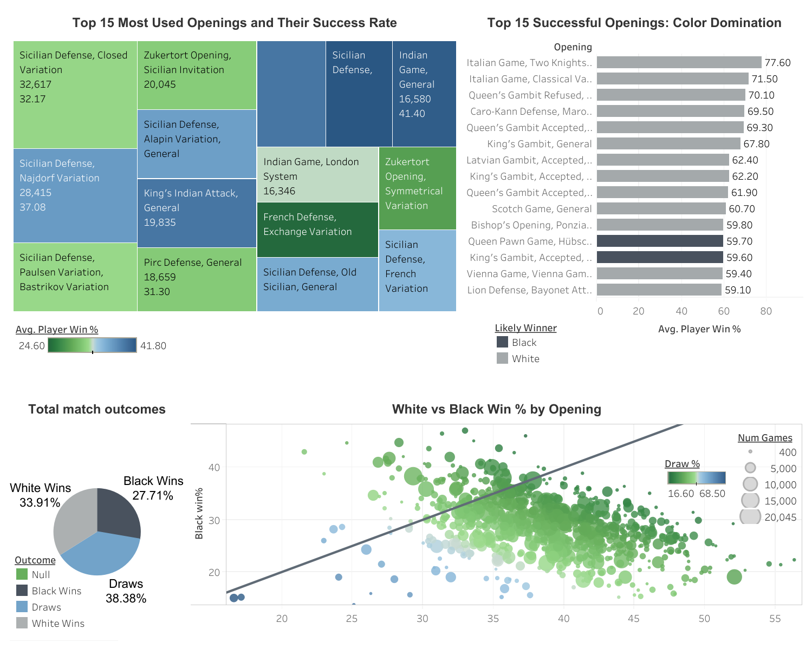
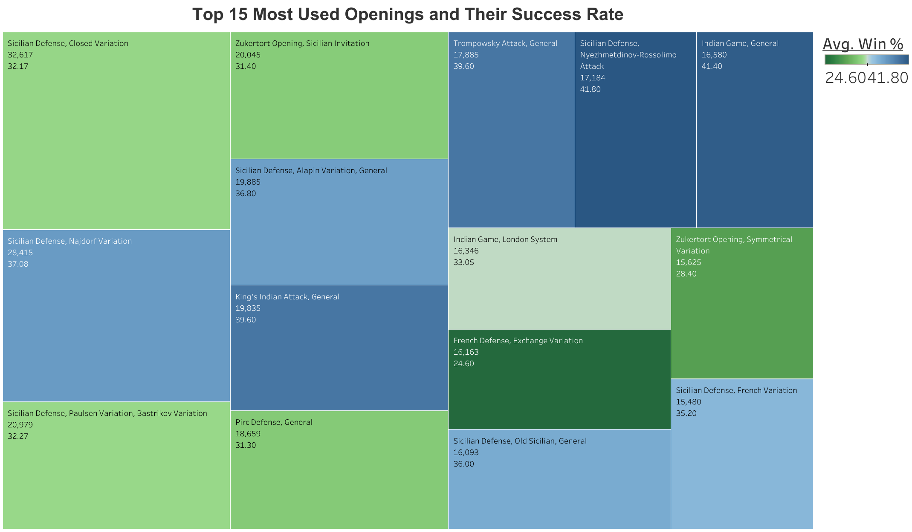
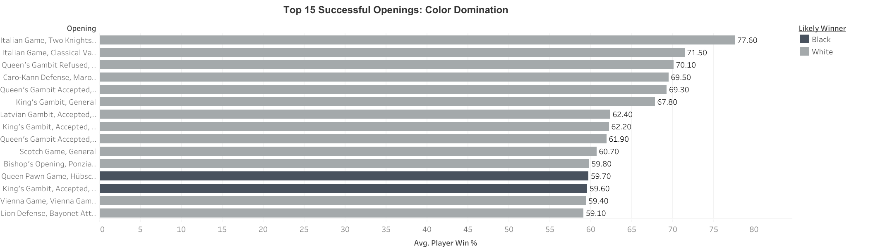
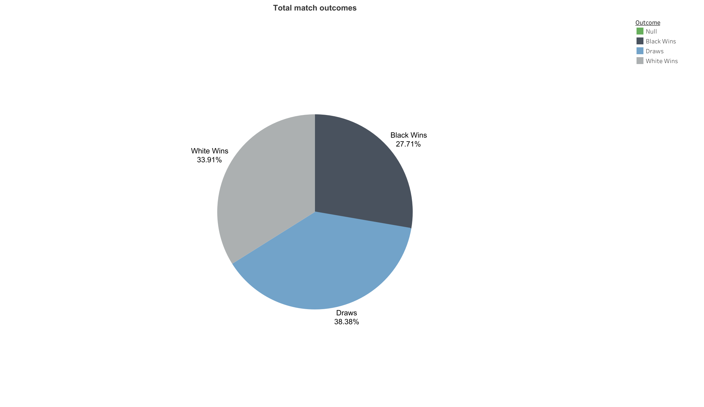
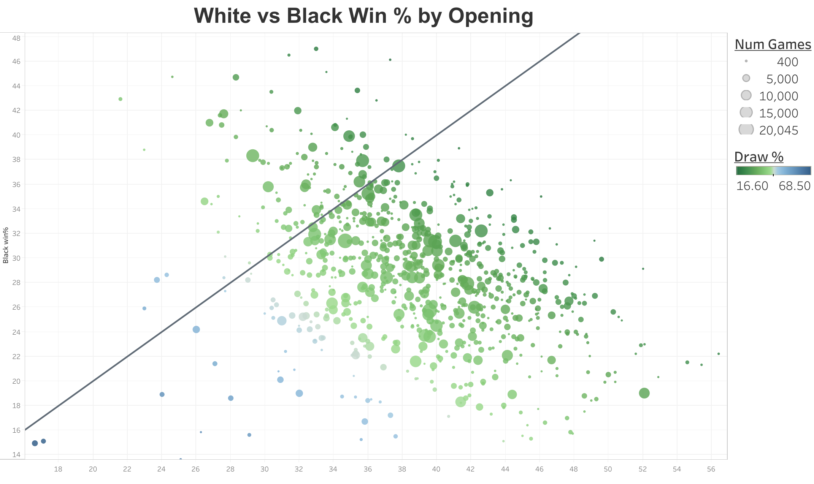

# Chess Stats Visualization on Tableau

<!-- Full dashboard preview image -->

  

This project explores trends in chess openings using a Kaggle dataset of thousands of online games. The dashboard, built in Tableau Public, highlights player win rates, draw percentages, and performance ratings across various chess openings. It helps answer questions like which openings are most successful, which color tends to win, and how player strength affects outcomes.

---
## 🔹 Treemap: Top 15 Most Successful Openings

  

  

    

      This bar chart displays the top 15 most successful chess openings ranked by player win percentage. It reveals that openings such as the Queen’s Gambit and Sicilian Defense are highly successful for the color they favor. These insights help players choose openings with the best statistical performance.
    

  

## 🔹 Bar Chart: Top 15 Most Successful Openings

  

  

    

      This bar chart displays the top 15 most successful chess openings ranked by player win percentage. It reveals that openings such as the Queen’s Gambit and Sicilian Defense are highly successful for the color they favor. These insights help players choose openings with the best statistical performance.
    

  

---

## 🔹 Pie Chart: Game Outcome Distribution

  
  

    

      The pie chart breaks down overall game outcomes across the dataset: wins by White, wins by Black, and draws. It shows that White holds a slight statistical advantage, while draws account for a significant portion of games, especially in balanced or defensive openings.
    

  

---

## 🔹 Scatter Plot: Player Performance by Opening

  
  

    

      This scatter plot visualizes the average performance rating of players who used each opening. Higher-rated players tend to use more positional or balanced openings. It also highlights which openings are favored among elite versus casual players.
    

  

---

## 🔗 View the Full Interactive Dashboard

Click below to explore the full dashboard on Tableau Public:

[➡️ View on Tableau Public](https://public.tableau.com/views/ChessStats_17544059915240/Dashboard1)

