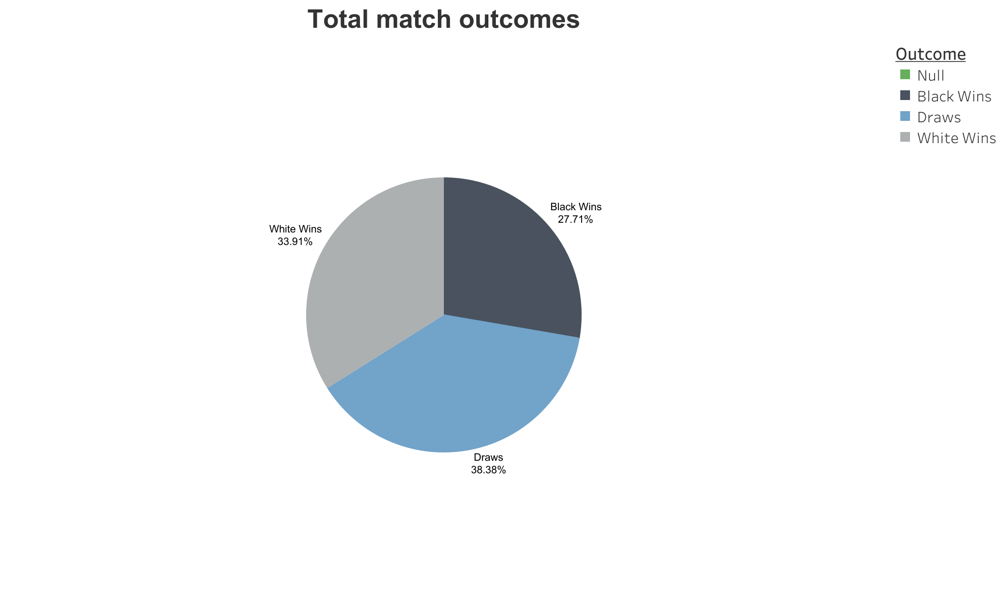

# Chess Stats Visualization on Tableau
--- 

Hello fellow chess fanatic! This project explores trends in chess openings using a [Kaggle](https://www.kaggle.com/datasets/alexandrelemercier/all-chess-openings) dataset of thousands of online games. The dataset was uploaded by the user: Alexandre Le Mercier, and updated a year ago. The dashboard, built in Tableau Public, highlights player win rates, draw percentages, and performance ratings across various chess openings. It helps answer questions like which openings are most successful, which color tends to win, and how player strength affects outcomes.

The data cosists of the following fields: 
- **Opening**: The name of the chess opening or defense variation.
- **Colour**: The side (White or Black) that the opening is more favorable towards.
- **Num Games**: The total number of games played with this opening.
- **ECO**: The Encyclopaedia of Chess Openings classification code.
- **Last Played**: The date of the latest game in the dataset utilizing this opening.
- **Perf Rating**: The average performance rating of players who have played this opening.
- **Avg Player**: The overall average rating of players in the dataset.
- **Player Win** %: The win rate for players using the opening.
- **Draw %**: The percentage of games that ended in a draw.
- **Opponent Win %**: The win rate against players using the opening.
- **Moves**: A sequence of the initial moves in standard chess notation.
- **Moves_list**: A comprehensive list of all moves made in the opening sequence.
- **Move1w to Move4b**: Detailed opening moves for both White and Black, up to the 4th move
- **White_win%, Black_win%**: The win percentages for White and Black.
- **White_odds**: The odds ratio favoring White based on win rates.
- **White_Wins, Black_Wins**: The total number of wins by White and Black.

<!-- Full dashboard preview image -->

  
  
Click the dashboard preview to view it interactively on Tableau Public

## 🔹 Treemap: The 15 Most Used Openings

  

  

    

      This treemap highlights the top 15 most popular chess openings from the dataset. The color gradient represents success rates based on player win percentages, with deeper green indicating lower win rates, deeper blue indicating higher success, and white sitting in the middle of the green-to-blue scale. The interactive viz displays each opening along with the total number of games it appears in and its average player win percentage.

What’s immediately clear from the data is that popularity doesn’t always equal success. For example, the most commonly played opening is the Sicilian Defense, Closed Variation, appearing in 32,617 games. However, it has a relatively low average win rate of just 32.17%. On the other hand, the Sicilian Defense, Nyezhmetdinov-Rossolimo Attack shows up in only 17,184 games, yet has the highest win rate at 41.80%.

So while certain openings are widely used, that doesn’t necessarily make them the most effective — sometimes the best moves are the ones less played. Keep in mind that this viz did not take player skill level into account.  S
    

  

## 🔹 Bar Chart: Top 15 Most Successful Openings

  

  

    

   So, what are the most successful chess openings according to this dataset? The bar chart showcases the top 15 most successful openings, ranked by average player win percentage. This means we're not looking at how often an opening is used, just how effective it is when it is used.

Interestingly, the top 15 most successful openings don’t overlap with the top 15 most common ones. That tells us something important: just because an opening is popular doesn’t necessarily mean it is effective. 

There’s also a classic debate in the chess world, does White have a natural advantage just by moving first? To explore that, each bar in the chart is color-coded: gray if White tends to win more with that opening, and black if Black is more likely to win.

According to the data, the Italian Game, Two Knights Defense, Fried Liver Attack is the most successful opening, with a 77.60% average win rate, favoring White. It’s not the most played on the list though. The most played is the Scotch Game, General, which shows up in 3,697 games, but has a lower overall win rate.

Most of the bars in the chart favor White, so does that mean White really has the advantage according to the data? Let’s take a closer look.

NOTE: draws are included in the interactive viz, shown as percentages, since not every game ends with a win for either side.
    

  

## 🔹 Pie Chart: Game Outcome Distribution

  
  

    

      The pie chart breaks down overall game outcomes across the dataset: wins by White, wins by Black, and draws. It shows that White holds a slight statistical advantage, while draws account for a significant portion of games, especially in balanced or defensive openings.
    

  

## 🔹 Scatter Plot: Color Performance by Opening

  
  

    

      This scatter plot visualizes the average performance rating of players who used each opening. Higher-rated players tend to use more positional or balanced openings. It also highlights which openings are favored among elite versus casual players.
    

  

## 🔗 View the Full Interactive Dashboard

Click below to explore the full dashboard on Tableau Public:

[➡️ View on Tableau Public](https://public.tableau.com/views/ChessStats_17544059915240/Dashboard1)

