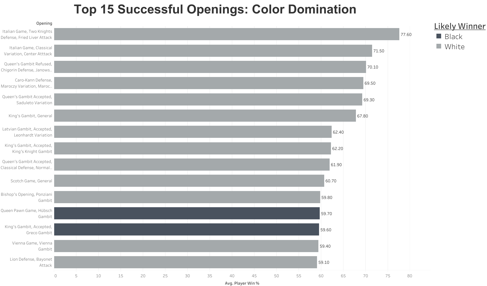

# Chess Stats Visualization on Tableau

Hello fellow chess fanatic! This project explores trends in chess openings using a [Kaggle](https://www.kaggle.com/datasets/alexandrelemercier/all-chess-openings) dataset of thousands of online games. The dataset was uploaded by the user: Alexandre Le Mercier, and updated a year ago. The dashboard, built in Tableau Public, highlights player win rates, draw percentages, and performance ratings across various chess openings. It helps answer questions like which openings are most successful, which color tends to win, and how player strength affects outcomes.

The data cosists of the following fields: 
- Opening: The name of the chess opening or defense variation.
- Colour: The side (White or Black) that the opening is more favorable towards.
- Num Games: The total number of games played with this opening.
- ECO: The Encyclopaedia of Chess Openings classification code.
- Last Played: The date of the latest game in the dataset utilizing this opening.
- Perf Rating: The average performance rating of players who have played this opening.
- Avg Player: The overall average rating of players in the dataset.
- Player Win %: The win rate for players using the opening.
- Draw %: The percentage of games that ended in a draw.
- Opponent Win %: The win rate against players using the opening.
- Moves: A sequence of the initial moves in standard chess notation.
- Moves_list: A comprehensive list of all moves made in the opening sequence.
- Move1w to Move4b: Detailed opening moves for both White and Black, up to the fourth move.
- White_win%, Black_win%: The win percentages for White and Black.
- White_odds: The odds ratio favoring White based on win rates.
- White_Wins, Black_Wins: The total number of wins by White and Black.

<!-- Full dashboard preview image -->

  
  
Click the dashboard preview to view it interactively on Tableau Public

---
## 🔹 Treemap: The 15 Most Used Openings

  

  

    

      This bar chart displays the top 15 most successful chess openings ranked by player win percentage. It reveals that openings such as the Queen’s Gambit and Sicilian Defense are highly successful for the color they favor. These insights help players choose openings with the best statistical performance.
    

  

## 🔹 Bar Chart: Top 15 Most Successful Openings

  

  

    

      This bar chart displays the top 15 most successful chess openings ranked by player win percentage. It reveals that openings such as the Queen’s Gambit and Sicilian Defense are highly successful for the color they favor. These insights help players choose openings with the best statistical performance.
    

  

---

## 🔹 Pie Chart: Game Outcome Distribution

  
  

    

      The pie chart breaks down overall game outcomes across the dataset: wins by White, wins by Black, and draws. It shows that White holds a slight statistical advantage, while draws account for a significant portion of games, especially in balanced or defensive openings.
    

  

--- 

## 🔹 Scatter Plot: Color Performance by Opening

  
  

    

      This scatter plot visualizes the average performance rating of players who used each opening. Higher-rated players tend to use more positional or balanced openings. It also highlights which openings are favored among elite versus casual players.
    

  

---

## 🔗 View the Full Interactive Dashboard

Click below to explore the full dashboard on Tableau Public:

[➡️ View on Tableau Public](https://public.tableau.com/views/ChessStats_17544059915240/Dashboard1)

